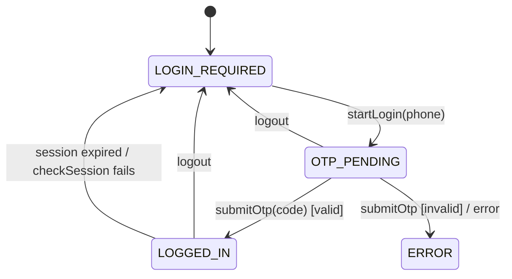

# Authentication Lifecycle

Some targets (e.g. Divar) require a logged-in session before crawling. Login is **OTP-based
and interactive**: a human starts it, the target sends a one-time code to a phone, and the
human enters that code back in the dashboard. The platform models this as a per-target state
machine.

## State machine

`CrawlerAuthStatus`: `LOGIN_REQUIRED · OTP_PENDING · LOGGED_IN · ERROR`

State lives on `CrawlSessionEntity` (one row per target): `authStatus`, `phone`,
`challengeRef` (correlates start→verify), `sessionData` (opaque provider payload — cookies,
tokens), `expiresAt`, `lastError`.

## Components

| Piece | Where | Role |
|---|---|---|
| `CrawlSessionService` | `sessions/crawl-session.service.ts` | Owns transitions; persists state; delegates the actual auth work |
| `CrawlerAuthProvider` | `providers/crawler-auth.interface.ts` | Site-specific auth strategy |
| `MockAuthProvider` | `providers/mock/` | Works; "sends" a code, accepts any 4–6 digit code |
| `DivarAuthProvider` | `providers/divar/` | Scaffold over `BrowserGateway`; throws `NotImplemented` |
| OTP modal | `apps/pwa/.../crawler.component.otp-login-modal.tsx` | Two-step UI: phone → code |

## HTTP contract (admin-guarded)

| Method & path | Body | Result (sanitized `AuthView`) |
|---|---|---|
| `GET  /crawler/targets/:id/auth` | — | current `{ authStatus, phone, expiresAt, lastError }` |
| `POST /crawler/targets/:id/auth/start` | `{ phone }` | `authStatus: OTP_PENDING` |
| `POST /crawler/targets/:id/auth/verify` | `{ otp }` | `authStatus: LOGGED_IN` (or `ERROR`) |
| `POST /crawler/targets/:id/auth/logout` | — | `authStatus: LOGIN_REQUIRED` |

> **Security:** the controller never returns `sessionData`. Only the sanitized `AuthView`
> (`toAuthView`) leaves the server.

## Intended Divar flow (future)

`DivarAuthProvider` is wired with the `BrowserGateway`. When implemented:

1. `startLogin`: open a tab → navigate to login → type phone → submit (Divar SMSes a code).
   Return the tab id as `challengeRef`.
2. `submitOtp`: reuse the tab → type the OTP → verify → `exportCookies` as `sessionData`.
3. `checkSession`: re-validate stored cookies; `logout`: clear them.

See [browser-gateway-camofox.md](../developer/browser-gateway-camofox.md) and
[authentication-providers.md](../developer/authentication-providers.md).
