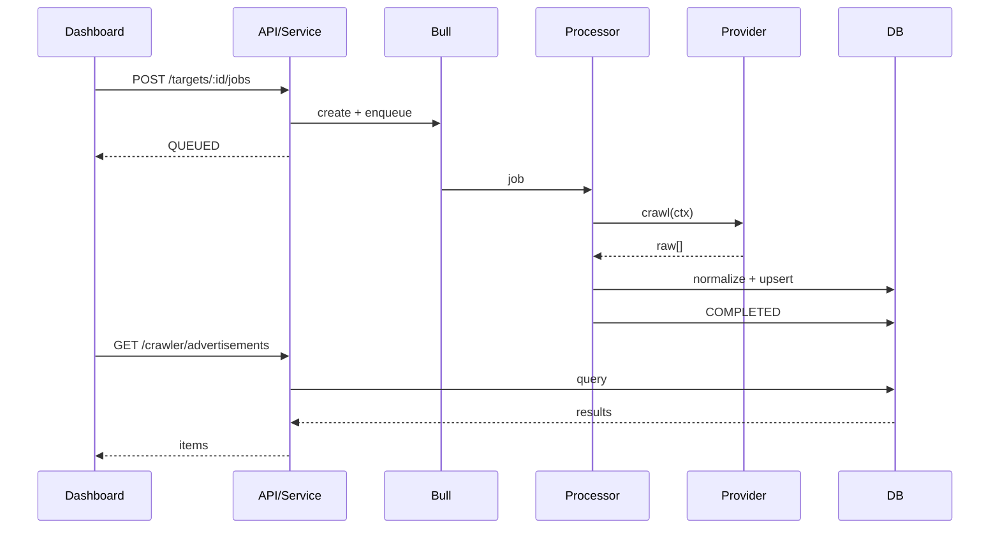

# Crawler Lifecycle

The journey of a crawl from "press run" to "ads in the dashboard".

## 1. Target registration

A **target** is a registered website (`CrawlTargetEntity`). Targets are seeded on startup by
`CrawlerBootstrapService` (Mock + Divar) and can also be created via
`POST /crawler/targets`. Each target carries a `siteKey` that links it to a
`CrawlerProvider` in the registry.

Target status (`CrawlTargetStatus`): `READY · RUNNING · ERROR · NOT_CONFIGURED`
Reachability (`TargetAccessibility`): `ONLINE · OFFLINE · UNKNOWN`

## 2. (Optional) authentication

If `target.requiresAuth` is true, an operator must establish a session first via the
interactive OTP flow — see [authentication-lifecycle.md](./authentication-lifecycle.md).
The Mock target needs no auth; the Divar target does.

## 3. Job creation & enqueue

`POST /crawler/targets/:id/jobs` → `CrawlJobService.enqueue`:

1. Validates the requested `CrawlJobType` against the provider's `supportedJobTypes`.
2. Creates a `CrawlJobEntity` in `PENDING`.
3. Adds a minimal payload (`{ jobId, maxItems }`) to the Bull `crawl-jobs` queue.
4. Moves the job to `QUEUED`.

Job status (`CrawlJobStatus`): `PENDING → QUEUED → RUNNING → COMPLETED | FAILED | CANCELED`
Job types (`CrawlJobType`): `FULL_SCAN · INCREMENTAL · SINGLE_AD`

## 4. Processing (the worker)

`CrawlJobProcessor` (a Bull `@Processor`) picks up the job. It runs inside a MikroORM
`@CreateRequestContext()` because Bull executes outside the HTTP request lifecycle.

```mermaid
flowchart TD
    A([RUNNING]) --> B[Resolve provider\nCrawlerProviderRegistry.get\(target.siteKey\)]
    B --> C[Load stored session]
    C --> D[provider.crawl\(ctx\)]
    D --> E{For each raw ad}
    E --> F[NormalizationService.extract\(raw\)\n→ NormalizedAdvertisement]
    F --> G[AdvertisementService.upsert\(target, job\)\n→ update stats]
    G --> E
    E -->|done| H{Result}
    H -->|success| I([COMPLETED\nstats persisted])
    H -->|error| J([FAILED\nerror persisted])
```

On success the target is set back to `READY` and `lastCrawledAt` is stamped. On failure the
target goes to `ERROR` with `lastError`.

## 5. Storage & display

Normalized ads are upserted into `RealEstateAdvertisementEntity`, keyed by
`(target, externalId)` so re-crawls update rather than duplicate. They surface in the
dashboard at `/dashboard/crawler/ads` via `GET /crawler/advertisements` (filter/search/paginate).

## Sequence (mock, happy path)


