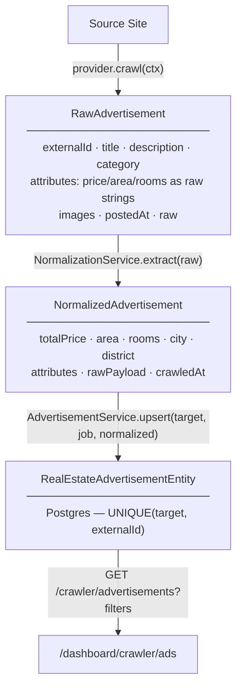

# Data Flow

How a listing on a target site becomes a typed, queryable record in the dashboard.

## Stage 1 — Raw extraction (provider)

`RawAdvertisement` (`providers/crawler-provider.interface.ts`) is intentionally permissive.
Prices, areas, and room counts may arrive as Persian-digit strings with units
("۱۲۰ متر"). `attributes` is a free-form bag; `raw` keeps the untouched source payload.

`externalId` + the target is the **natural key**.

## Stage 2 — Normalization (pipeline)

`NormalizationService` implements `ExtractionPipeline<NormalizedAdvertisement>`:

- Converts Persian/Arabic digits via the shared `normalizeNumbers` util
  (`src/libs/utils/pipe.normalizeNumbers.ts`).
- Extracts integers from unit-suffixed strings into typed columns
  (`totalPrice`, `deposit`, `rent`, `area`, `rooms`, …).
- Preserves the original `attributes` and stores the source payload as `rawPayload` so
  records can be re-processed if the mapping improves later.

This stage is the seam for **future AI enrichment**: add another `ExtractionPipeline` stage
that takes the raw ad (or a page snapshot) and fills gaps via an LLM, then compose it before
persistence.

## Stage 3 — Persistence (service)

`AdvertisementService.upsert` looks up `(target, externalId)`:
- exists → `em.assign` the new values (and the producing `job`) → flush, `created: false`
- new → create → flush, `created: true`

The processor uses `created` to keep accurate per-job stats (`found / created / updated / skipped`).

## Stage 4 — Display (dashboard)

`AdvertisementService.search` powers `GET /crawler/advertisements` with pagination and
filters: `targetId`, `category`, `city`, `district`, `rooms`, `minPrice`/`maxPrice`, and a
free-text `q` over title/description (`$ilike`). The dashboard renders results with the
shared `DataView` + `Pagination` components.

This structure is designed to later support **categorization, review workflows, and AI
enrichment** by adding columns/stages without changing the contract.
