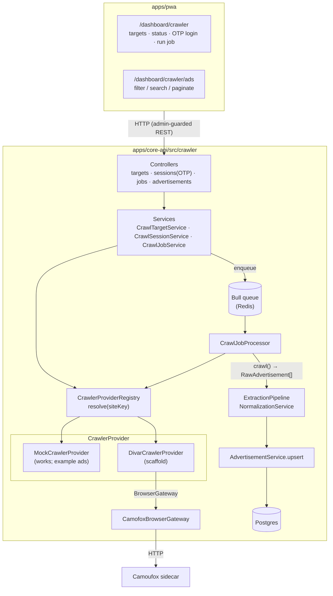

# Architecture Overview

The crawler is a self-contained NestJS module (`apps/core-api/src/crawler/`) plus a
dashboard domain (`apps/pwa/src/app/dashboard/crawler/`). It depends only on shared infra
(MikroORM base classes, Bull/Redis, the auth guards) and exposes everything over HTTP, so
it stays decoupled from the rest of the application.

## High-level diagram

## Module map

| Area | Path | Responsibility |
|---|---|---|
| Constants/enums | `crawler.constants.ts` | Status enums, queue name, DI tokens, site keys |
| Targets | `targets/` | Registered sites: entity, CRUD, status |
| Sessions | `sessions/` | Interactive OTP state machine, session storage |
| Jobs | `jobs/` | Job entity, Bull producer (`CrawlJobService`) + worker (`CrawlJobProcessor`) |
| Providers | `providers/` | `CrawlerProvider`/`CrawlerAuthProvider` interfaces, registry, mock + divar impls |
| Browser | `browser/` | `BrowserGateway` interface + `CamofoxBrowserGateway` HTTP client |
| Pipeline | `pipeline/` | `ExtractionPipeline` + `NormalizationService` + `RealEstateAdvertisementEntity` |
| Bootstrap | `crawler.bootstrap.service.ts` | Seeds the Mock + Divar targets on startup |

## Key abstractions (the extension points)

All four are interfaces with at least one working implementation. Future phases extend the
platform by adding implementations, **not** by editing the core.

1. **`CrawlerProvider`** (`providers/crawler-provider.interface.ts`)
   A site-specific crawler. Receives a `CrawlContext`, returns `RawAdvertisement[]`. Knows
   nothing about NestJS, HTTP or the DB.

2. **`CrawlerAuthProvider`** (`providers/crawler-auth.interface.ts`)
   A site-specific auth strategy driving `startLogin → submitOtp → checkSession/logout`.

3. **`BrowserGateway`** (`browser/browser-gateway.interface.ts`)
   A transport-agnostic browser. The shipped impl talks to the Camoufox stealth-browser
   sidecar over HTTP; swap the `BROWSER_GATEWAY` provider to change backends.

4. **`ExtractionPipeline<T>`** (`pipeline/extraction-pipeline.interface.ts`)
   Transforms a raw ad into a normalized, persistable shape. The natural seam for future AI
   enrichment stages.

## Why this shape

- **Decoupling.** Providers are plain classes behind interfaces; the registry is the only
  place that knows concrete types. The app never imports a provider directly.
- **Runs today.** The Mock provider exercises the entire pipeline (queue → normalize →
  persist → dashboard) without any external dependency, so the contracts are proven.
- **Realistic seams.** The Divar scaffold is wired exactly like a real provider (auth +
  browser gateway) and only its data-producing methods throw `NotImplemented`, marking
  precisely where future work goes.
