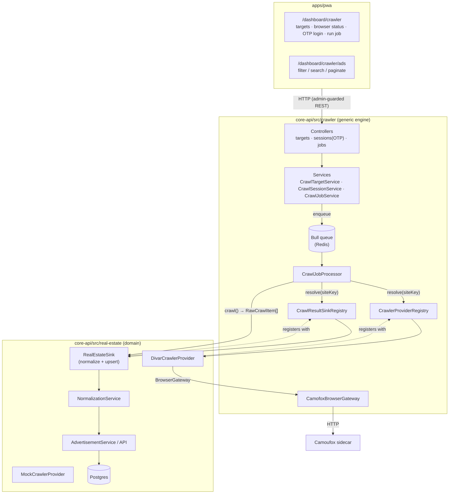

# Architecture Overview

The crawling platform is split into two backend modules plus a dashboard domain:

- **`apps/core-api/src/crawler/`** — a **generic, domain-agnostic crawling engine**: targets,
  auth sessions, the Bull job queue + worker, the browser gateway, and the provider/sink
  registries. It knows nothing about any specific site or domain entity.
- **`apps/core-api/src/real-estate/`** — a **domain module** that *uses* the engine: it owns
  the advertisement entity/store/API, the normalization pipeline, the site providers (Mock,
  Divar), and registers them with the engine at startup.
- **`apps/pwa/src/app/dashboard/crawler/`** — the dashboard.

Both backend modules depend only on shared infra (MikroORM base classes, Bull/Redis, the auth
guards) and expose everything over HTTP.

## High-level diagram

The engine resolves a **provider** and a **sink** by the target's `siteKey`, runs
`provider.crawl()` to get domain-agnostic `RawCrawlItem`s, and hands them to the sink. The
real-estate module's sink normalizes and persists them as advertisements.

## Module map

### Engine — `core-api/src/crawler/`

| Area | Path | Responsibility |
|---|---|---|
| Constants/enums | `crawler.constants.ts` | Generic status enums, queue name, `BROWSER_GATEWAY` token |
| Targets | `targets/` | Registered sites: entity, CRUD, status, browser-health endpoint |
| Sessions | `sessions/` | Interactive OTP state machine, session storage |
| Jobs | `jobs/` | Job entity, Bull producer (`CrawlJobService`) + worker (`CrawlJobProcessor`) |
| Providers | `providers/` | `CrawlerProvider`/`CrawlerAuthProvider` interfaces + registry (no concrete impls) |
| Sink | `sink/` | `CrawlResultSink` interface + registry (the domain seam) |
| Browser | `browser/` | `BrowserGateway` interface + `CamofoxBrowserGateway` HTTP client |

### Domain — `core-api/src/real-estate/`

| Area | Path | Responsibility |
|---|---|---|
| Constants | `real-estate.constants.ts` | `RealEstateCategory`, `SiteKey` |
| Raw shape | `real-estate.raw.ts` | `RawAdvertisement` (typed `RawCrawlItem.data`) + helper |
| Entity/API | `advertisement.*` | `RealEstateAdvertisementEntity`, service, search API (`/real-estate/advertisements`) |
| Pipeline | `normalization.service.ts`, `extraction-pipeline.interface.ts` | Raw → normalized fields |
| Sink | `real-estate.sink.ts` | `CrawlResultSink` impl: normalize + upsert |
| Providers | `providers/mock/`, `providers/divar/` | Site crawlers + auth |
| Wiring | `real-estate.registration.ts`, `real-estate.bootstrap.service.ts` | Register providers/sink; seed targets |

## Key abstractions (the extension points)

1. **`CrawlerProvider`** (`crawler/providers/crawler-provider.interface.ts`)
   A site-specific crawler. Receives a `CrawlContext`, returns `RawCrawlItem[]` (a stable
   `externalId` + an opaque `data` bag). Knows nothing about NestJS, HTTP or the DB.

2. **`CrawlerAuthProvider`** (`crawler/providers/crawler-auth.interface.ts`)
   A site-specific auth strategy driving `startLogin → submitOtp → checkSession/logout`.

3. **`CrawlResultSink`** (`crawler/sink/crawl-sink.interface.ts`)
   The domain seam. Consumes a provider's `RawCrawlItem[]` and persists them into a domain
   store. The real-estate module registers one sink for all its site keys.

4. **`BrowserGateway`** (`crawler/browser/browser-gateway.interface.ts`)
   A transport-agnostic browser. The shipped impl talks to the Camoufox stealth-browser
   sidecar over HTTP; swap the `BROWSER_GATEWAY` provider to change backends.

5. **`ExtractionPipeline<T>`** (`real-estate/extraction-pipeline.interface.ts`)
   Transforms a raw item into a normalized, persistable shape. The natural seam for future
   AI enrichment stages.

## Why this shape

- **Engine vs domain.** The engine never imports domain code; domain modules register
  providers + sinks against the engine's registries (`*.registration.ts`). A non-real-estate
  vertical is a new module + entity + sink — no engine changes.
- **Decoupling.** Providers/sinks are plain classes behind interfaces; the registries are the
  only place that knows concrete types.
- **Runs today.** The Mock provider exercises the whole path (queue → normalize → persist →
  dashboard) with no external dependency. The **Divar** provider is implemented and validated
  against the live site (close map → infinite scroll → per-ad detail enrichment).
